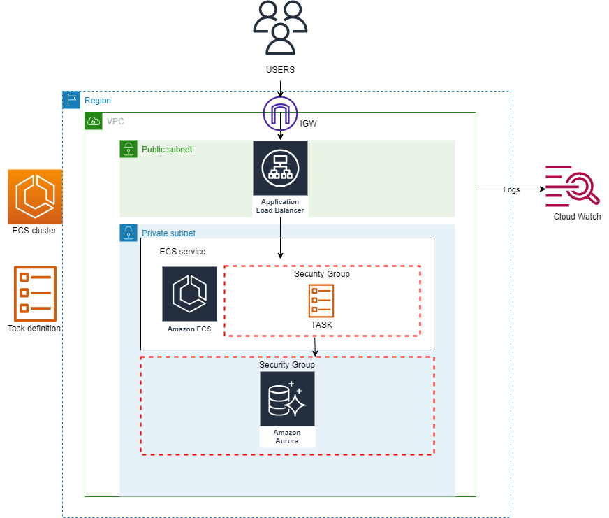

# Terraform AWS Microblog Deployment

This project deploys the Microblog application on AWS using ECS with Fargate and Aurora RDS.

## Overview

- **Docker Hub:** Hosts the Microblog application image.
- **ALB:** An Application Load Balancer that manages incoming traffic.
- **ECS with Fargate:** Provides scalable, serverless containerized deployment.
- **Aurora RDS:** A managed relational database service utilized by the application.

## Prerequisites

- AWS account with necessary permissions.
- Terraform v1.4.4.
- The Microblog application image available on Docker Hub.

## Key Resources

- **Security Groups:** Set traffic rules for the ALB and Microblog containers.
- **IAM Roles:** Includes task execution and task roles for resource permissions.
- **SecretsManager:** Handles sensitive data, such as database passwords and registry tokens.
- **CloudWatch Log Groups:** Logs ECS task executions.

## Quickstart

1. **Setup Terraform**: Install the recommended Terraform version and initialize your project using `terraform init`.
2. **Configure Secrets**: Set up all required secrets in AWS SecretsManager.
   - Create db_credentials with your database username and password.
   - Create registry_docker_hub_credentials, username and password for accessing your Docker Hub image.
3. **Verify Docker Hub Image**: Confirm the availability of the Microblog application image on Docker Hub.
4. **Deploy**: Execute `terraform apply` to deploy resources on AWS.

🔒 **Security Tip**: Always manage secrets and sensitive data using AWS SecretsManager or similar services. Never commit them directly to version control.

## Service Fail-Over

### Auto-recovery for ECS with Fargate

If a task in ECS stops unexpectedly, the service scheduler launches a replacement in the ECS cluster. This mechanism provides inherent fail-over support. You can simulate a task failure by stopping it manually and observing how ECS automatically initiates a replacement.

### Auto-recovery for RDS

RDS with Multi-AZ deployments ensures high availability and failover support for DB instances.

## Architecture Diagram

## Cleanup

To remove deployed resources and avoid incurring additional costs, run `terraform destroy`.

